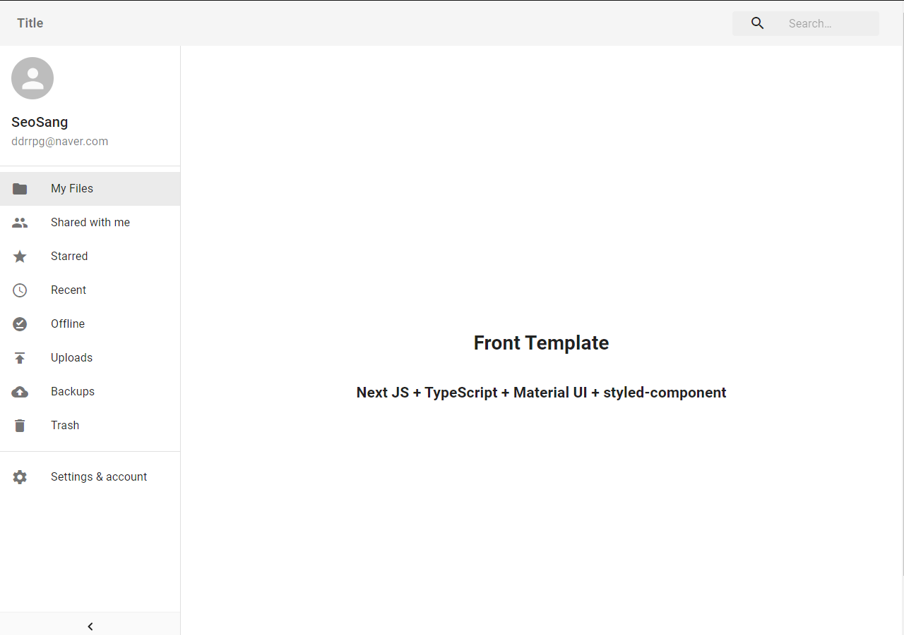

# Frontend Template

frontend template for Next JS + Typescript !

- Langauge : Typescript
- FrameWork : React, Next JS
- Style Guide : Material-UI, styled-components

# Example



# Usage

```bash
$ git clone https://github.com/SeoSang/frontend_template.git
$ cd frontend_template
$ npm install
$ npm run dev
```

## Author

[SeoSang](https://github.com/SeoSang)

- Blog : https://programming119.tistory.com
- Site : [https://i-am-seo-sang.vercel.app/](https://i-am-seo-sang.vercel.app/)
- E-mail : ddrrpg@naver.com

Ref

- [Next JS](https://nextjs.org/)
- https://www.npmjs.com/package/@mui-treasury/layout

## License

This project is licensed under the **MIT** License
